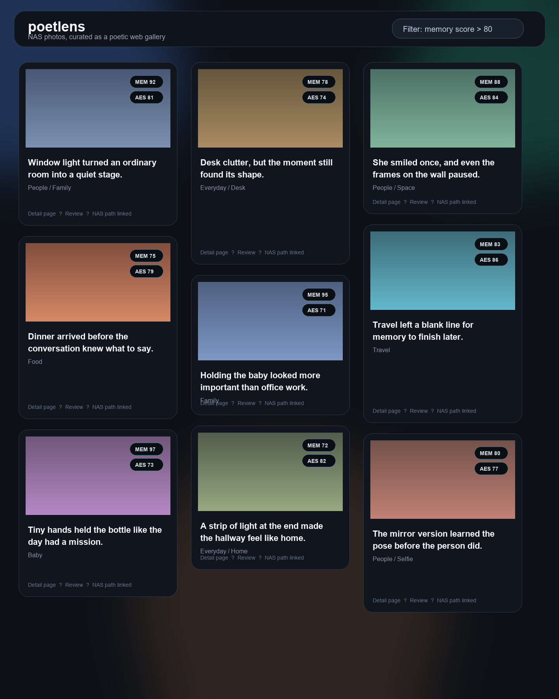
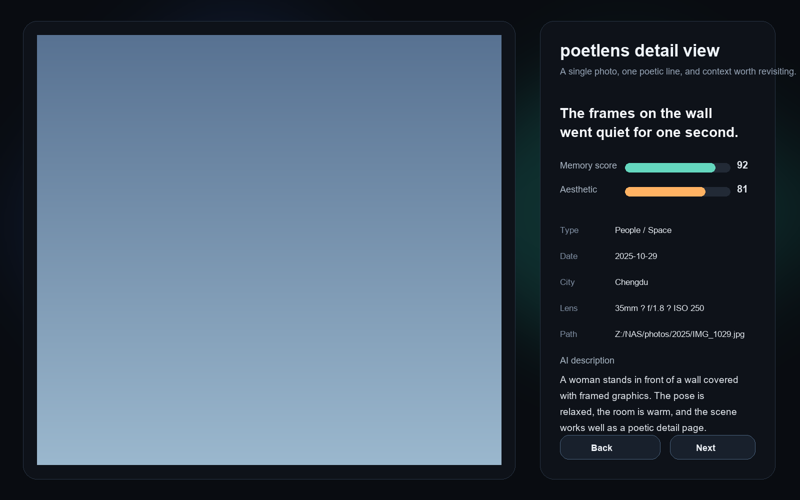

# Poetic Lens

> 让相册重新开口说话。

我们拍下的照片越来越多，手机、相机、NAS 里沉睡着成千上万张瞬间。它们不是没有意义，只是太容易被新的照片覆盖，被时间折叠进文件夹深处。

Poetic Lens 想做的事情很简单：用大模型替你重新走进自己的相册，找到那些真正值得停下来的照片，再用一两句带有诗意的中文文案，把画面里的光、风、地点和情绪重新唤醒。

它不是一个普通相册，也不只是一个 AI 打标签工具。它更像一间为私人记忆准备的小画廊：照片负责作证，模型负责凝视，文字负责把你带回那一刻。

## 预览

### 照片画廊



### 照片详情



## 它解决什么

照片越多，回看的门槛越高。我们经常记得“我好像拍过”，却很少真的回去看；更少有耐心从几万张照片里，找出那些构图、情绪和记忆都值得留下的瞬间。

Poetic Lens 试图把这个过程变轻：

- 它会扫描 NAS 或本地相册里的真实照片。
- 它会借助本地视觉大模型理解画面，生成描述、分类和评分。
- 它会帮你筛出更有回忆感、更有观看价值的照片。
- 它会为照片写下适合网页展示的中文短句，让照片不只是“被看见”，也能“被重新感受”。

## 核心能力

### 本地相册变成私人网页

把 NAS、SMB 挂载目录，或本地照片目录交给 Poetic Lens，它会基于真实文件路径读取照片，并在网页中生成适合回看、筛选和展示的照片画廊。

### 用大模型挑出更好的照片

项目支持接入本地视觉模型，例如通过 [LM Studio](https://lmstudio.ai/) 暴露的 OpenAI 兼容接口。模型会分析照片内容、构图、情绪和记忆价值，帮助你从庞大的相册里找出更值得驻足的部分。

### 诗意文案，而不是冷冰冰的标签

Poetic Lens 不满足于写出“这是一只猫”或“这是一座山”。它会尝试生成更接近观看感受的短句，让每张照片带上一点余温：像是你当时没说出口的话，后来由系统轻轻补上。

### 适合长期回看的画廊体验

项目内置画廊页、详情页和 review 流程。你可以先批量分析照片，再在网页里检查高分照片、调整筛选结果、确认 AI 文案，慢慢把自己的相册整理成一座有叙事感的私人展馆。

## 项目结构

```text
poetlens/
├── analyze_local_qwen.py   # 调用本地视觉模型分析照片
├── analyze_photos.py       # 照片扫描、EXIF 和批量分析流程
├── server.py               # Flask Web 服务
├── templates/              # 网页模板
├── docs/images/            # README 示例截图
├── config-example.py       # 配置示例
├── Dockerfile              # 容器部署示例
└── requirements.txt        # Python 依赖
```

## 快速开始

### 1. 安装依赖

推荐使用 Python 3.9+。

```bash
python3 -m venv venv
# Windows: venv\Scripts\activate
# Linux / macOS: source venv/bin/activate
pip install -r requirements.txt
```

### 2. 准备配置

```bash
cp config-example.py config.py
# Windows PowerShell:
# Copy-Item config-example.py config.py
```

至少需要确认这些字段：

- `SQLALCHEMY_DATABASE_URI`：数据库连接，推荐使用 MySQL；项目主要围绕 `image_analysis` 表工作。
- `IMAGE_DIR` / `PHOTOS_BASE_DIR`：你的 NAS 挂载目录或本地照片根目录。
- `API_URL` / `MODEL_NAME`：本地视觉大模型接口和模型名称。
- `DOWNLOAD_KEY`：用于受保护静态资源访问的随机密钥，建议改成足够长的随机字符串。
- `ENABLE_REVIEW_WEBUI`：是否启用照片 review 页面。

### 3. 安装 exiftool

可选但推荐，用于更稳定地读取 EXIF 和 GPS 信息。

```bash
# macOS
brew install exiftool

# Debian / Ubuntu
apt-get install -y libimage-exiftool-perl
```

Windows 用户可以下载 `exiftool.exe` 并加入环境变量。

## 分析照片

先启动本地模型服务，例如 LM Studio 的 OpenAI 兼容接口：

```text
http://127.0.0.1:1234/v1
```

然后执行：

```bash
python analyze_local_qwen.py "你的照片目录"
```

分析流程会扫描照片、读取 EXIF / GPS、调用本地视觉模型，并生成 `caption`、`type`、`memory_score`、`beauty_score` 和 `one_sentence_copy` 等字段，写入数据库供网页展示。

## 启动网页

```bash
python server.py
```

浏览器访问：

```text
http://[你的服务器IP]:8765/
```

网页侧重点包括：

- 按照片质量和回忆感浏览画廊
- 查看单张照片详情和诗意文案
- 在 review 页面检查 AI 评分与文案结果
- 基于本地 / NAS 路径提供图片访问

## 部署到 NAS

如果你希望让 Poetic Lens 长期运行在 NAS 或小主机上，可以使用仓库里的 `Dockerfile`。

建议部署方式：

- 把真实相册目录挂载到容器内。
- 把数据库连接和模型服务地址写入 `config.py`。
- 暴露 `8765` 端口。
- 将批量分析任务和网页服务分开运行，便于长期维护。

## 隐私说明

Poetic Lens 默认面向个人相册和局域网环境设计。推荐把照片、数据库和模型都保留在自己的设备或 NAS 中。

- 不要提交 `config.py`、数据库、日志、模型文件和分析输出。
- 如果使用本地视觉模型，照片分析过程可以不离开你的机器。
- 如果改用云端模型接口，请自行确认照片上传和数据保留策略。

## License

MIT
