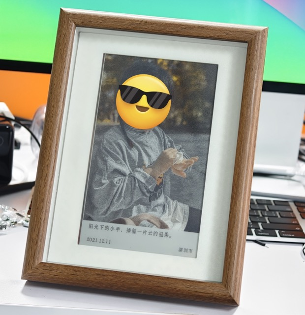

# poetlens · 墨水屏回忆相框

<p align="left">
  
</p>

poetlens 是一个「拉回你相册里的记忆」的墨水屏电子相框项目。

它不会随机展示照片，也不是简单的按时间轴播放，而是：

- 用 AI 理解每一张照片在“拍什么”
- 给照片按照“值得回忆度”“美观度”打分
- 写一句灵光一现的旁白文案
- 每天从“历史上的今天”里选出**最值得被再次看到的照片**
- 推送到 ESP32 墨水屏上展示

---

## 🚀 核心亮点

### 💡 1. 彻底的数据隐私：纯本地跑视觉大模型 (Local VLM)
本项目完美支持利用**本地显卡（GPU）**进行相册分析。通过使用 [LM Studio](https://lmstudio.ai/) 等工具，你可以一键运行类似 `qwen3-vl` 的视觉多模态大模型。完全不需要把包含了无数隐私的照片长传给云端厂商！所有的推理都在你的电脑上完成，百分百安全。

### 💾 2. 拥抱私有云：极空间 (Zspace) 等 NAS 完美兼容
无论是通过 SMB 直连，还是在**极空间 NAS**利用 Docker 部署。你都可以直接把极空间中的照片真实路径映射进来，无需在此之外来回拷贝相片。

---

## 📦 项目整体结构

poetlens 分为三部分：

1. **照片分析（Python）**  
   扫描相册 → 调用视觉模型 → 分类 / 评分 / 写文案 → 存入数据库。
2. **图片渲染（Python）**  
   从数据库里选出「历史上的今天」高分照片 → 渲染成 ESP32 可直接显示的 `.bin`。
3. **下载与展示（ESP32）**  
   ESP32 定时从服务器拉取 `.bin` → 刷新墨水屏 → 深度休眠直至下次唤醒。

---
## 🛠 环境准备

### 1）Python 依赖
推荐 Python 3.9+。
建议使用虚拟环境：
```bash
python3 -m venv venv
# Windows: venv\Scripts\activate.bat 或者 activate.ps1
# Linux/Mac: source venv/bin/activate
pip install -r requirements.txt
```

### 2）安装 exiftool （可选，推荐）
poetlens 需要 exiftool 来更无损地获取照片 EXIF 信息（特别是 GPS 坐标）。   
Windows: 从官网下载后重命名为 `exiftool.exe` 并将其扔进全局环境变量里。  
MacOS: `brew install exiftool`  
NAS/Linux: `apt-get install -y libimage-exiftool-perl`  

### 3) 配置 `config.py`
```bash
cp config-example.py config.py
# Windows PowerShell:
# Copy-Item config-example.py config.py
```
打开 `config.py`，至少需要确认以下字段：  
1. **数据库连接**：推荐配置 `SQLALCHEMY_DATABASE_URI` 指向 MySQL，当前 `server.py` 与分析流程默认基于 `image_analysis` 表工作。  
2. **照片库路径**：`IMAGE_DIR` 和 `PHOTOS_BASE_DIR` 填写你挂载或本地所在的真实路径，例如 `Z:/我的相册` 或 `/app/static/photos`。  
3. **下载秘钥**：请把 `DOWNLOAD_KEY` 改成随机字符串，并在 ESP32 固件里填写相同的值。  
4. **本地兼容模式**：如果你仍在使用旧版 SQLite 数据库，可保留 `DB_PATH`，`render_daily_photo.py` 会在未配置 MySQL 时回退到它。

### 4) 隐私与仓库内容说明
- `config.py`、数据库、日志、`output/` 结果文件默认不入库，请不要把真实凭证和个人照片直接提交到 GitHub。
- `models/` 目录里的大模型文件建议自行下载到本地或通过 Git LFS 管理，不建议把真实权重二进制直接塞进普通 Git 历史。

---

## 🚀 如何使用本地显卡（LM Studio）分析照片

为保证隐私与免费的无限算力体验，首推使用本地显卡跑大模型分析相册。

1. **配置 LM Studio**  
   打开 LM Studio 并下载 `qwen3-vl` 等视觉多模态大模型。在 Local Server 页面打开服务。LM Studio 默认会启动 `http://127.0.0.1:1234/v1` 的 OpenAI 兼容接口。
2. **检查脚本配置**  
   确保使用的是 `analyze_local_qwen.py`（内部默认请求对应端口）。  
3. **执行扫描和分析**  
   将你的目标相册真实路径传给脚本即可开始慢慢分析：
   ```bash
   python analyze_local_qwen.py "你的真实照片目录路径"
   ```
   *注意：程序具有断点续传能力，已处理的照片不会重复请求接口。你可以每天挂机跑一点，直到跑完你所有的相册库。*

---

## 🐳 极空间 (Zspace) 等 NAS 部署服务端

为了让电子相框不用依赖你的主力 PC 运行，推荐将服务端与每日渲染任务使用 Docker 部署在你的极空间 NAS 上。

1. **构建或获取 Docker 镜像**  
   已经在代码中内置了 `Dockerfile`。你可以直接在极空间 Docker-镜像标签 下选择**基于 Dockerfile 构建**（或是你在电脑端编译好扔过去）。
2. **路径挂载 (核心)**  
   为了读取极空间的相片，在极空间的 Docker 容器启动配置中：
   增加挂载路径：将你真实的极空间相册文件夹（如 `/相册/宝宝图库`）映射到容器内部的 `/app/static/photos` 中。
3. **暴露端口** 
   将容器内暴露的 `8765` 端口映射到极空间的外部任意端口。
4. **自动运行生成**  
   在 NAS 上，可利用极空间的“定时任务”或者进入容器内写 `crontab`，每日凌晨定时运行：  
   `python render_daily_photo.py` 

---

## 📺 运行与 WebUI 可视化审查
服务端正常提供 API 以及网页后台：

执行终端命令：
```bash
python server.py
```

在浏览器中访问：`http://[服务端所在IP]:8765/`  或类似你配置的端口地址。  
在网页上，你可以查看各种照片通过 AI 生成的有趣点评文案。

### 每日渲染与下发
```bash
python render_daily_photo.py
```

脚本会优先读取 MySQL 中的 `image_analysis` 数据；如果没有配置 MySQL，则会回退到本地 SQLite 数据库。

---

## 🖼️ ESP32 墨水屏硬件制作

项目在 `esp32/` 目录下包含了完整的 Arduino 源码、PCB 原理图、BOM 表等。
1. **主控硬件**：推荐基于 ESP32-S3-N8R8。屏幕推荐 7.3寸四色纯墨水屏。可参考 PCB 目录自行打板。
2. **固件编译**：采用 VSCode + Arduino 插件烧录（请引入 `GxEPD2` 等依赖库）。
3. **网络与接口配置**：
   在烧录前或通过 WiFi 自动配网 AP (配网热点默认 `poetlens` 前缀，密码 `12345678`) 内：
   输入你配置好的服务端后台内网地址和下载鉴权密码（DOWNLOAD_KEY）。

完成配置后，相框每天准时唤醒，抓取你当天最值得重温的历史画面，然后无感刷新进入深睡。开启美好回忆的一天！

---
## 💡 鸣谢与版权
- ESP32 固件驱动依赖底层 [GxEPD2 © ZinggJM](https://github.com/ZinggJM/GxEPD2)
- 中文离线经纬度查城市名数据库基于 [GeoNames](https://www.geonames.org/)
- 开源许可：本项目采用 MIT License （ESP32相关遵循原有库GPL规定除外）。
